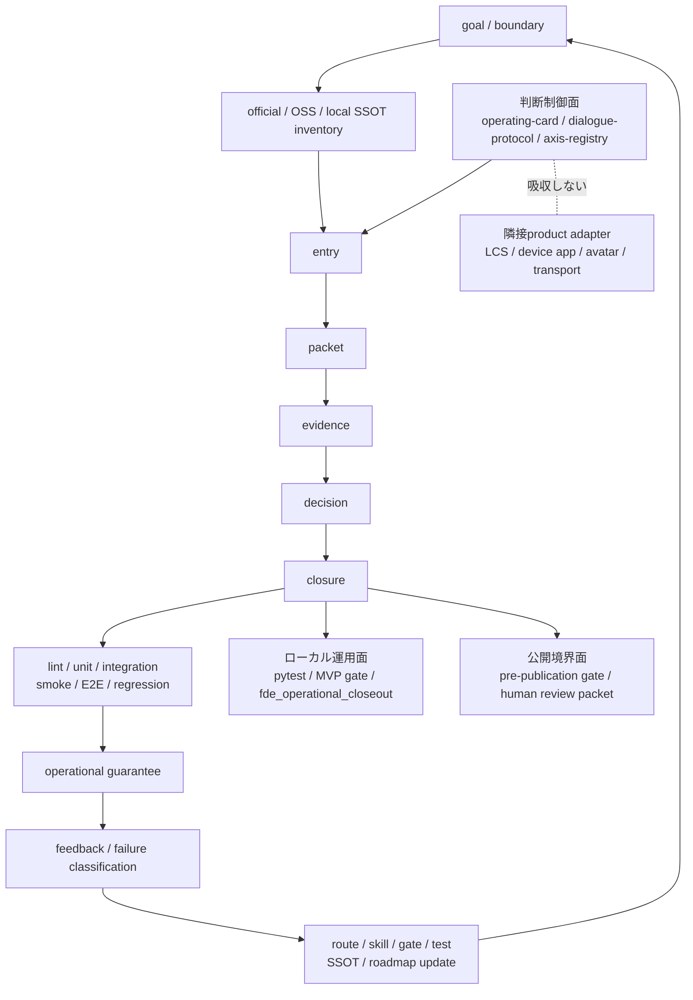

# FDE 全体図

この overview は、FDE の完成図を1枚で確認するための入口です。
FDE は product runtime ではなく、AI作業を目標から運用保証、学習、system updateまで閉じる判断・開発制御面です。

## 判断制御面

FDE は、曖昧な依頼を毎回 `entry -> packet -> evidence -> decision -> closure` に戻します。
ここで見るものは、主に `README.md`、`ROADMAP.md`、`visual.html`、`fde_workflow.yaml` です。

`entry -> packet -> evidence -> decision -> closure` は内側の判断loopです。外側では `goal_and_boundary -> capability_inventory -> roadmap -> preflight -> implement -> verify -> operational_guarantee -> feedback -> system_update` を回し、学習結果を次のgoalへ戻します。

## 継続学習面

feedback は失敗を記録して終わりません。`failure_kind` と `postmortem_action` を evidence に接続し、`route / skill / gate / test / ssot / roadmap` のどこを直すか決めます。system update の採用には `evidence / rollback_path / adoption_gate` が必要です。

## ローカル運用面

ローカルでは、`scripts/fde_operational_closeout.py` が実装残務、運用残務、外部/公開承認ブロッカーを分けます。
これは read-only の確認であり、外部送信、公開、repo visibility 変更、patent filing は実行しません。
`--require-delivery-ready` を付けると、clean worktreeとupstream同期もclose conditionに含めます。出力の `context_to_preserve` と `resume_checks` がchat引継ぎのmachine-readable正本です。
run単位の証跡は`workflow_execution_receipt`にgoal、boundary、planned transitionとcompleted/blocked実績、check時刻/digest、verification applicability、feedback/system-update判断を持ちます。`--write-context-receipt`でignored `.fde-runtime/closeout-receipts/`へimmutableな履歴として永続化できます。

## 公開境界面

public release、repository visibility 変更、external send、patent filing は、現在の会話で対象と操作を明示した人間承認があるまで止めます。
local gate success は public release approval ではありません。

## 隣接product adapter

LCS（life-commons-system）、device app、avatar、transport は、FDE 本体へ吸収しない隣接 product です。
FDE は判断制御面としてこれらの製品仕様や実装を抱え込まず、必要な時は adapter 経由で接続するだけにとどめます。
device/app/OS/avatar/transport の仕様検討は、この repository ではなく別 product 側で行います。

## 機能マップ

README、ROADMAP、TODO、workflow、closeout を機能別に読むための入口です。実装済みと外部承認待ちを混ぜないため、各機能は必ず gate と一緒に見ます。

| 機能 | 入口 | 確認すること |
|---|---|---|
| System overview | `SYSTEM_OVERVIEW.md` | 層、workflow、機能、roadmap funnel を1枚で見る |
| Workflow manifest | `fde_workflow.yaml` | intake から external approval stop までの state を見る |
| Closed-loop learning | `fde_workflow.yaml` | goal から operational guarantee、feedback、system update、次のgoalまでが閉じているか |
| Operational closeout | `scripts/fde_operational_closeout.py` | implementation、operation、external/public residue を分ける |
| Operational guarantee | `OPERATIONAL_GUARANTEE.md` | private local complete と public approval の分離を見る |
| TODO | `TODO_IMPACT_EXECUTION_2026-07-01.md` | 実行済みTODO、外部承認TODO、closeout bundle を見る |
| Roadmap | `ROADMAP.md` | Now / Next / Future と gate を見る |
| Public boundary | `PUBLIC_READY.md` | 公開準備と未承認の停止線を見る |

## roadmap funnel

ROADMAP.md の Now / Next / Future は、そのまま実行される予定表ではなく、gate を通るごとに絞り込まれる funnel です。
Now は MVP gate、Next は roadmap gate、Future は pre-publication gate を通らない限り前段のまま留まります。

