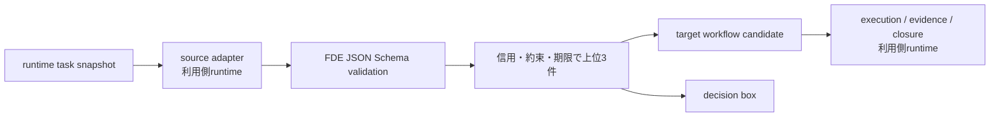

# FDE Task Routing Contract

FDEはproduct runtimeを抱えません。この契約は、散在する案件について
明示された事実だけを使って優先順位を決め、1サイクルで重要な3件までを
実行候補、自己解決、人間判断へ振り分ける制御面です。

Codex、Obsidian、task inventory、executor、状態保存、完了反映は
利用側runtimeの責務です。FDEは共通Schema、優先順位、route、安全境界だけを
提供します。

## 優先順位

次の順で加点し、同点なら古い案件を先に扱います。

1. 期限超過・24時間以内・7日以内
2. 明示した約束、暗黙の約束
3. 待っている人、停止しているチーム
4. 安全、金銭、データ、信用へのリスク
5. 上記に該当しない内部改善

タイトルの文言から重要度を推測しません。入力にない期限、約束、他者影響は
`unknown`のまま扱い、事実として補完しません。

## 安全境界

外部送信、公開、push、プルリクエスト、merge、課金、認証情報、認証、
設定変更、破壊操作は実行候補にせず、decision boxへ送ります。

安全なローカルworkflowは実行候補として宣言できますが、FDE policy自身は
executorを呼びません。完了判定も利用側runtimeの責務であり、証拠と人間承認を
改ざん不能な形でbindingできないruntimeはfail-closedにしなければなりません。

manifestのcapabilityは、登録scriptの意図を事前検査する宣言契約です。
OSレベルのnetwork sandboxやread-only filesystemを保証するものではありません。
target workflow runnerを利用する場合は、remote・commit・tree・command・
script hashが固定され、cleanなtargetだけに限定します。



## 計画

```powershell
python scripts\fde_task_manager.py tasks.json --json
```

入力は`fde.manager_task.v1`の配列、または`{"tasks": [...]}`です。
必須項目は`schemas/fde_manager_task.v1.schema.json`を正本とし、
`tests/test_task_manager.py`のfixtureを実行例として参照します。
CLIは計画だけを返し、executor、source adapter、状態更新を持ちません。
結果の`external_actions_performed`は常に`false`です。

## 利用側runtimeの必須条件

- source固有adapterはFDE外に置く
- `unknown`を実行可能へ格上げしない
- FDE planの上位3件だけを対象にする
- 外部境界を現在会話の承認なしに実行しない
- 1件の失敗を封じ込め、後続の安全なtaskを継続する
- 完了を証拠と人間レビューへbindingする
